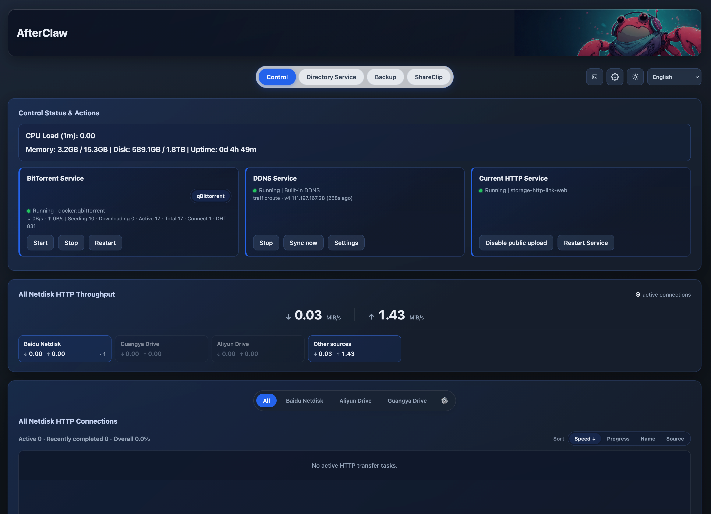

# AfterClaw

**AfterClaw** is a unified control center for home and small-studio servers.
It brings file browsing, transfer visibility, service control, DDNS, and lightweight clipboard sharing into one operational surface.

Language: **English (Default)** | [简体中文](#简体中文)



## Use Case — netdisk media libraries

If you run **POPCorn (爆米花)**, **VidHub**, or a similar app, your movies and TV live on a netdisk so they can be streamed on demand. The hard part is getting the media *onto* the netdisk: the netdisk client throttles upload ratio and needs a browser tab held open the whole time.

AfterClaw is the server-side uploader for that workflow:

1. **Clean the names** — the naming module tidies messy movie and TV filenames so the library stays consistent.
2. **Stream-upload to netdisk** — the HTTP transfer pipeline pushes large files with resume support, no throttled client and no browser tab to babysit.
3. **Play from netdisk** — POPCorn / VidHub read the uploaded library straight from the netdisk. Per-process upload speed for 百度网盘 / 光鸭网盘 / 阿里云盘 is visible on the process-net page.

## Why AfterClaw

AfterClaw was built to solve a practical problem: server workflows become fragile when they are spread across too many scripts and panels.

With one dashboard, teams can:

- keep operations consistent across laptops, mini PCs, and NAS environments
- reduce migration friction when paths and services change between machines
- recover faster with a single place to inspect system and transfer status

## Core Capabilities

- **Unified dashboard** for system health, transfer activity, and service status
- **Directory service** to browse `STORAGE_ROOT` and generate file links
- **HTTP transfer pipeline** with large-file streaming and resume support
- **Service operations** for qBittorrent, DDNS, and HTTP service controls
- **Web terminal** with key file management for remote maintenance
- **ShareClip module** for lightweight clipboard-style sharing
- **LAN-first safety model** with controllable public transfer exposure

## Quick Start

```bash
WEB_PORT=1288 \
STORAGE_ROOT=/srv/Storage \
PUBLIC_HOST=example.com:1288 \
PUBLIC_SCHEME=http \
python3 -m fcc
```

Compatibility entry is also available:

```bash
python3 app.py
```

## Install

Recommended:

```bash
sudo bash install.sh
```

Platform-specific installers are orchestrated by:

- `scripts/install_ubuntu.sh`
- `scripts/install_mint.sh`
- `scripts/install_macos.sh`
- `scripts/install_windows.ps1`

Windows (PowerShell as Administrator):

```powershell
powershell -ExecutionPolicy Bypass -File .\install.ps1
```

## GitHub Actions Build

Workflow file: `.github/workflows/installers.yml`

- Trigger: `push` and manual `workflow_dispatch`
- Platforms: Linux, macOS, Windows
- Output: packaged installers uploaded as Actions artifacts

---

## 简体中文

<details>
<summary>切换到中文说明</summary>

### 产品定位

**AfterClaw** 是一个面向家庭与小型工作室服务器的一体化中控台。
它把文件目录、传输看板、服务控制、DDNS 和轻量剪贴板分享收敛到同一个入口。

### 应用场景：网盘影音库

如果你用 **爆米花（POPCorn）**、**VidHub** 或类似应用，电影和剧集会存放在网盘上以便随时在线播放。麻烦的是把片源传**上**网盘：网盘客户端会限制上传倍率，还得一直开着浏览器标签页。

AfterClaw 就是这套流程的服务端上传器：

1. **整理文件名**——命名模块整理杂乱的电影和剧集文件名，让影音库保持一致。
2. **流式上传到网盘**——HTTP 传输链路推送大文件并支持断点续传，不再受客户端限速，也不用守着浏览器标签页。
3. **从网盘播放**——爆米花 / VidHub 直接读取上传到网盘的影音库。百度网盘 / 光鸭网盘 / 阿里云盘的各进程上传速度可在网盘进程网络明细页查看。

### 为什么开发 AfterClaw

核心目标是解决“面板多、脚本散、迁移难”的问题：

- 不同设备（旧笔记本、迷你主机、NAS）之间保持一致的操作体验
- 机器迁移时减少路径和服务配置漂移
- 出问题时可以在一个页面快速定位状态并恢复

### 核心能力

- **统一看板**：系统状态、实时传输、服务状态
- **目录服务**：浏览 `STORAGE_ROOT` 并生成文件链接
- **HTTP 传输链路**：大文件流式传输与断点续传
- **服务控制**：页面内控制 qBittorrent / DDNS / HTTP 服务
- **远程终端**：Web Terminal + key 文件管理
- **轻量分享**：ShareClip 模块用于剪贴板式内容分享
- **安全策略**：默认局域网访问，公网传输可独立开关

### 快速启动

```bash
WEB_PORT=1288 \
STORAGE_ROOT=/srv/Storage \
PUBLIC_HOST=example.com:1288 \
PUBLIC_SCHEME=http \
python3 -m fcc
```

兼容入口：

```bash
python3 app.py
```

### 安装

推荐执行：

```bash
sudo bash install.sh
```

Windows（管理员 PowerShell）：

```powershell
powershell -ExecutionPolicy Bypass -File .\install.ps1
```

### GitHub 自动构建

工作流：`.github/workflows/installers.yml`

- 触发：每次 `push` 和手动触发
- 平台：Linux / macOS / Windows
- 产物：自动上传安装包到 Actions Artifacts

</details>

## Versioning / 版本命名规则

- **Stable (`main`)** uses strict SemVer release tags: `MAJOR.MINOR.PATCH` (example: `0.9.6`).
- **Nightly (`nightly`)** uses PEP 440 development versions: `MAJOR.MINOR.NEXT_PATCH.devYYYYMMDD` (example: `0.9.7.dev20260501`).
- `.dev0` is reserved for local bootstrap only and must not be used as a published stable version.
- Promotion rule: nightly verifies first; stable version is updated only when explicitly approved.
