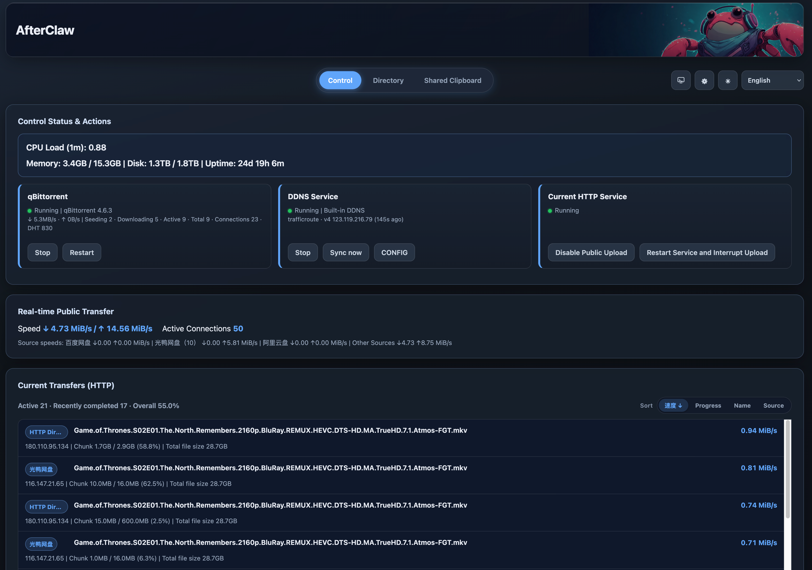

# AfterClaw

**AfterClaw** is a unified control center for home and small-studio servers.
It brings file browsing, transfer visibility, service control, DDNS, and lightweight clipboard sharing into one operational surface.

Language: **English (Default)** | [简体中文](#简体中文)



## Why AfterClaw

AfterClaw was built to solve a practical problem: server workflows become fragile when they are spread across too many scripts and panels.

With one dashboard, teams can:

- keep operations consistent across laptops, mini PCs, and NAS environments
- reduce migration friction when paths and services change between machines
- recover faster with a single place to inspect system and transfer status

## Core Capabilities

- **Unified dashboard** for system health, transfer activity, and service status
- **Directory service** to browse `STORAGE_ROOT` and generate file links
- **HTTP transfer pipeline** with large-file streaming and resume support
- **Service operations** for qBittorrent, DDNS, and HTTP service controls
- **Web terminal** with key file management for remote maintenance
- **ShareClip module** for lightweight clipboard-style sharing
- **LAN-first safety model** with controllable public transfer exposure

## Quick Start

```bash
WEB_PORT=1288 \
STORAGE_ROOT=/srv/Storage \
PUBLIC_HOST=example.com:1288 \
PUBLIC_SCHEME=http \
python3 -m fcc
```

Compatibility entry is also available:

```bash
python3 app.py
```

## Install

Recommended:

```bash
sudo bash install.sh
```

Platform-specific installers are orchestrated by:

- `scripts/install_ubuntu.sh`
- `scripts/install_mint.sh`
- `scripts/install_macos.sh`
- `scripts/install_windows.ps1`

Windows (PowerShell as Administrator):

```powershell
powershell -ExecutionPolicy Bypass -File .\install.ps1
```

## GitHub Actions Build

Workflow file: `.github/workflows/installers.yml`

- Trigger: `push` and manual `workflow_dispatch`
- Platforms: Linux, macOS, Windows
- Output: packaged installers uploaded as Actions artifacts

## Docs

- Deployment and migration guide: `DEPLOY.md`

---

## 简体中文

<details>
<summary>切换到中文说明</summary>

### 产品定位

**AfterClaw** 是一个面向家庭与小型工作室服务器的一体化中控台。
它把文件目录、传输看板、服务控制、DDNS 和轻量剪贴板分享收敛到同一个入口。

### 为什么开发 AfterClaw

核心目标是解决“面板多、脚本散、迁移难”的问题：

- 不同设备（旧笔记本、迷你主机、NAS）之间保持一致的操作体验
- 机器迁移时减少路径和服务配置漂移
- 出问题时可以在一个页面快速定位状态并恢复

### 核心能力

- **统一看板**：系统状态、实时传输、服务状态
- **目录服务**：浏览 `STORAGE_ROOT` 并生成文件链接
- **HTTP 传输链路**：大文件流式传输与断点续传
- **服务控制**：页面内控制 qBittorrent / DDNS / HTTP 服务
- **远程终端**：Web Terminal + key 文件管理
- **轻量分享**：ShareClip 模块用于剪贴板式内容分享
- **安全策略**：默认局域网访问，公网传输可独立开关

### 快速启动

```bash
WEB_PORT=1288 \
STORAGE_ROOT=/srv/Storage \
PUBLIC_HOST=example.com:1288 \
PUBLIC_SCHEME=http \
python3 -m fcc
```

兼容入口：

```bash
python3 app.py
```

### 安装

推荐执行：

```bash
sudo bash install.sh
```

Windows（管理员 PowerShell）：

```powershell
powershell -ExecutionPolicy Bypass -File .\install.ps1
```

### GitHub 自动构建

工作流：`.github/workflows/installers.yml`

- 触发：每次 `push` 和手动触发
- 平台：Linux / macOS / Windows
- 产物：自动上传安装包到 Actions Artifacts

### 文档

- 部署与迁移：`DEPLOY.md`

</details>
